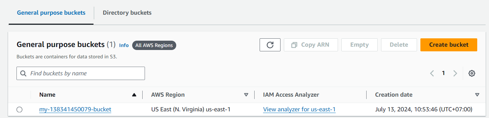
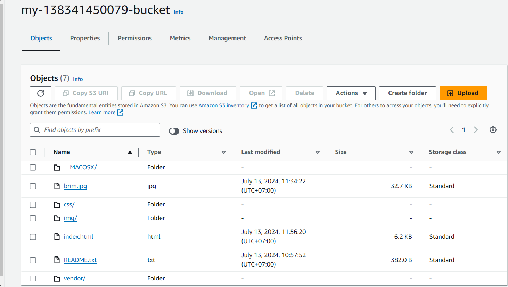
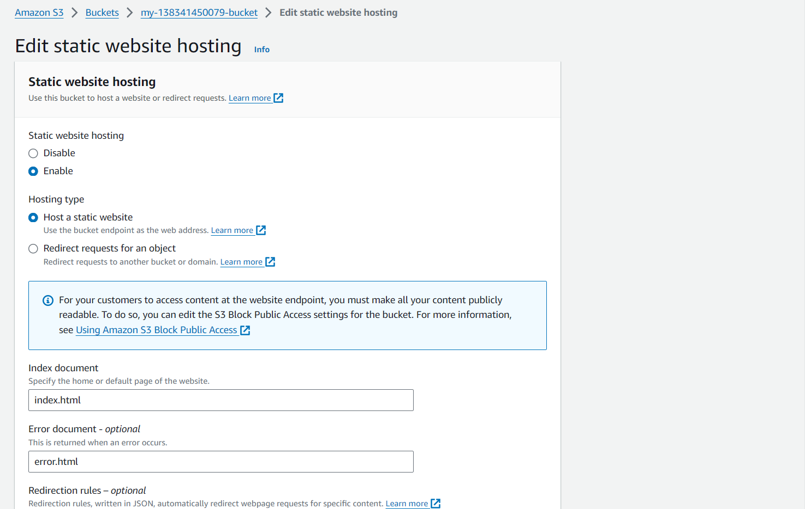
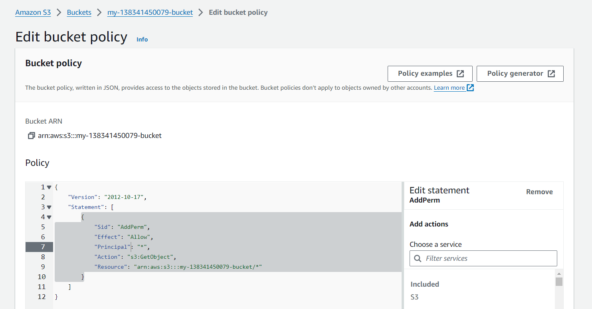
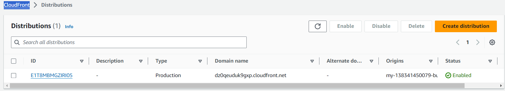
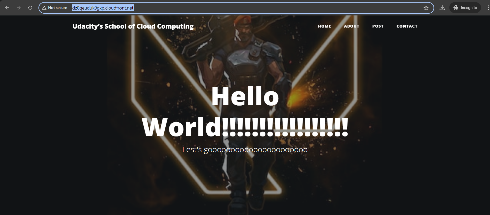
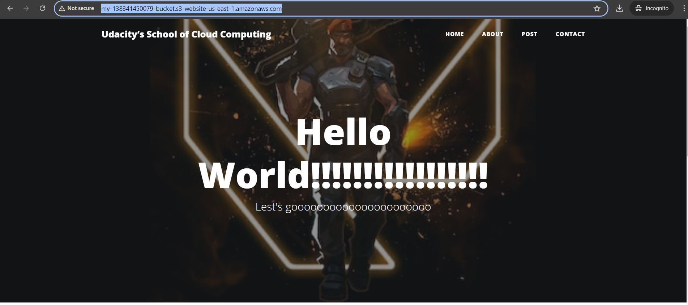
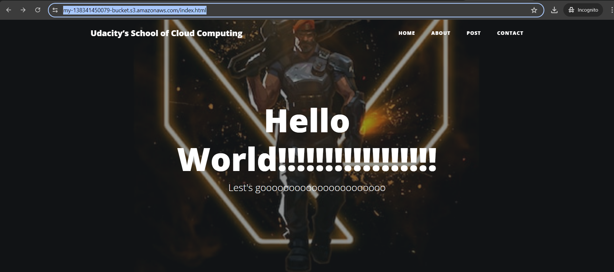

# My link
    http://dz0qeuduk9gxp.cloudfront.net/

# S3
## The S3 bucket is created.

## The website les uploaded to the newly created S3 bucket

## The S3 bucket is congured to support static website hosting.

## IAM bucket policy that makes the bucket contents publicly accessible

# CloudFront 
## Website Distribution

# Web Browser Access
## Cloudfront: 
http://dz0qeuduk9gxp.cloudfront.net/

## Static website hosting
http://my-138341450079-bucket.s3-website-us-east-1.amazonaws.com/

## Object URL
https://my-138341450079-bucket.s3.amazonaws.com/index.html

